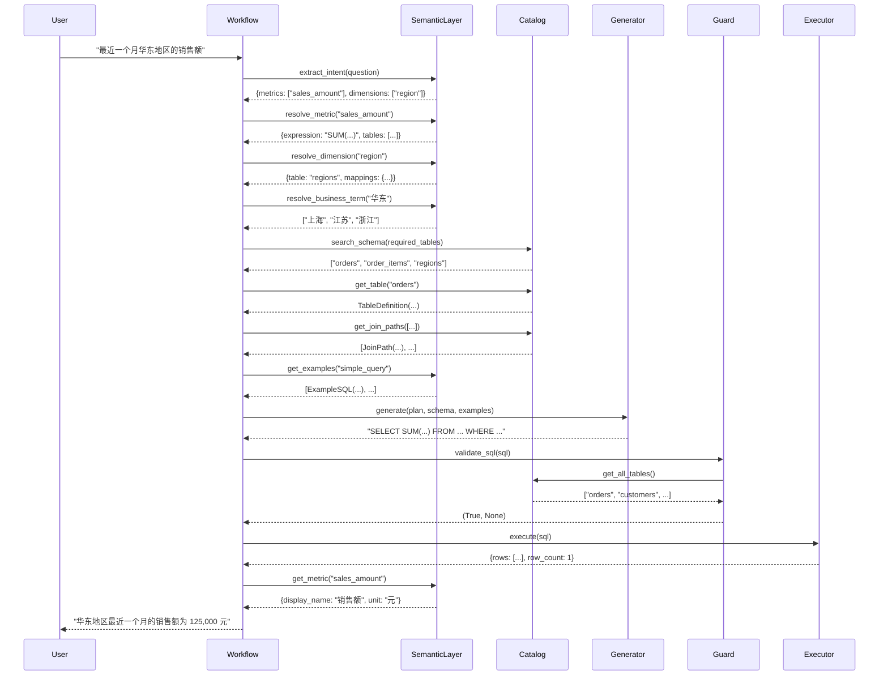

# RDS Agent Metadata API 调用流程

本文档详细说明 RDS Agent 在数据查询过程中如何调用 metadata 相关的 API。

## 目录

1. [整体流程概览](#整体流程概览)
2. [各节点的 Metadata API 调用](#各节点的-metadata-api-调用)
3. [Metadata API 详细说明](#metadata-api-详细说明)
4. [调用时序图](#调用时序图)
5. [代码追踪](#代码追踪)

---

## 整体流程概览

```
用户问题: "最近一个月华东地区的销售额是多少？"
    ↓
[1] classify_request
    → semantic_layer.extract_intent()        # Metadata: 指标、维度、术语
    ↓
[2] resolve_semantics
    → semantic_layer.resolve_metric()        # Metadata: 指标定义
    → semantic_layer.resolve_dimension()     # Metadata: 维度定义
    → semantic_layer.resolve_time_range()    # Metadata: 时间解析
    → semantic_layer.resolve_business_term() # Metadata: 业务术语
    ↓
[3] select_schema
    → catalog.search_schema()                # Metadata: 表结构检索
    → catalog.get_table()                    # Metadata: 表详细信息
    → catalog.get_join_paths()               # Metadata: Join 关系
    ↓
[4] create_query_plan
    → planner.create_plan()                  # 使用上述 metadata 创建计划
    ↓
[5] generate_sql
    → generator.generate()                   # Metadata: Schema + 语义 → SQL
    → catalog.get_table()                    # Metadata: 字段类型验证
    → semantic_layer.get_examples()          # Metadata: 示例 SQL
    ↓
[6] validate_sql
    → guard.validate_sql()                   # Metadata: 表白名单、字段白名单
    → catalog.get_all_tables()               # Metadata: 允许的表列表
    ↓
[7] explain_sql
    → executor.explain()                     # 数据库元数据：执行计划
    ↓
[8] execute_sql
    → executor.execute()                     # 数据库元数据：结果集 schema
    ↓
[9] validate_result
    → validator.validate()                   # Metadata: 预期数据类型、范围
    → semantic_layer.get_metric()            # Metadata: 指标定义验证
    ↓
[10] compose_answer
    → composer.compose()                     # Metadata: 指标名称、单位、说明
    → semantic_layer.get_metric_display()    # Metadata: 展示信息
```

---

## 各节点的 Metadata API 调用

### 节点 1: classify_request (分类请求)

**目标**: 理解用户意图，提取结构化信息

**Metadata API 调用**:

```python
# workflow/nodes.py - classify_request()

# 1. 提取意图（使用 LLM + Metadata）
intent = self.semantic_layer.extract_intent(question)
# 调用内部：
#   - self.semantic_layer.metrics       # 所有可用指标
#   - self.semantic_layer.dimensions    # 所有可用维度
#   - self.semantic_layer.terms         # 业务术语字典
```

**Metadata 来源**:
- `config/metrics.yaml` - 指标定义
- `config/dimensions.yaml` - 维度定义
- `config/terms.yaml` - 业务术语

**返回数据结构**:
```python
{
    "question_type": "simple_query",
    "metrics": ["sales_amount"],        # 识别的指标
    "dimensions": ["region", "time"],   # 识别的维度
    "time_range": "近一个月",
    "filters": ["华东地区"]
}
```

---

### 节点 2: resolve_semantics (解析语义)

**目标**: 将业务术语映射到数据库实体

**Metadata API 调用**:

```python
# workflow/nodes.py - resolve_semantics()

# 1. 解析指标
for metric_name in intent["metrics"]:
    metric_def = self.semantic_layer.resolve_metric(metric_name)
    # 返回：
    # {
    #     "name": "sales_amount",
    #     "expression": "SUM(order_items.net_amount)",
    #     "tables": ["orders", "order_items"],
    #     "filters": ["orders.status IN ('paid', 'completed')"]
    # }

# 2. 解析维度
for dim_name in intent["dimensions"]:
    dim_def = self.semantic_layer.resolve_dimension(dim_name)
    # 返回：
    # {
    #     "name": "region",
    #     "table": "regions",
    #     "column": "region_name",
    #     "mappings": {
    #         "华东": ["上海", "江苏", "浙江"],
    #         "华北": ["北京", "天津", "河北"]
    #     }
    # }

# 3. 解析时间范围
time_spec = self.semantic_layer.resolve_time_range(
    intent["time_range"]
)
# 返回：
# {
#     "start_date": "2026-08-01",
#     "end_date": "2026-09-01",
#     "column": "orders.order_date"
# }

# 4. 解析业务术语
for term in intent["filters"]:
    resolved = self.semantic_layer.resolve_business_term(term)
    # "华东地区" → ["上海", "江苏", "浙江"]
```

**Metadata 来源**:
- `config/metrics.yaml` - 指标计算逻辑
- `config/dimensions.yaml` - 维度映射规则
- `config/terms.yaml` - 术语同义词

---

### 节点 3: select_schema (选择 Schema)

**目标**: 检索相关的表结构和 Join 关系

**Metadata API 调用**:

```python
# workflow/nodes.py - select_schema()

# 1. 检索相关表
relevant_tables = self.catalog.search_schema(
    question=question,
    required_tables=resolved_intent["tables"]
)
# 使用嵌入检索或关键词匹配

# 2. 获取表详细信息
table_details = []
for table_name in relevant_tables:
    table = self.catalog.get_table(table_name)
    # 返回 TableDefinition 对象：
    # {
    #     "name": "orders",
    #     "description": "订单表",
    #     "columns": {
    #         "order_id": {"type": "INTEGER", "primary_key": True},
    #         "customer_id": {"type": "INTEGER", "foreign_key": "customers.id"},
    #         "order_date": {"type": "DATE"},
    #         "total_amount": {"type": "DECIMAL"}
    #     }
    # }
    table_details.append(table)

# 3. 获取 Join 路径
if len(relevant_tables) > 1:
    join_paths = self.catalog.get_join_paths(relevant_tables)
    # 返回：
    # [
    #     {
    #         "left": "orders.customer_id",
    #         "right": "customers.id",
    #         "type": "INNER JOIN",
    #         "cardinality": "many_to_one"
    #     }
    # ]
```

**Metadata 来源**:
- `config/schema.yaml` - 表结构定义
- `self.catalog.join_graph` - Join 关系图（从 schema.yaml 构建）

---

### 节点 4: create_query_plan (创建查询计划)

**目标**: 决定查询策略（单步/多步）

**Metadata API 调用**:

```python
# workflow/nodes.py - create_query_plan()

plan = self.planner.create_plan(
    intent=resolved_intent,
    schema_context=schema_context
)

# Planner 内部使用 Metadata：
# - semantic_layer.metrics[metric_name]  # 指标定义
# - catalog.get_join_paths()             # Join 路径
# - 判断是否需要子查询、CTE、多步查询
```

**返回数据结构**:
```python
{
    "plan_type": "single_query",
    "metrics": [
        {
            "name": "sales_amount",
            "expression": "SUM(order_items.net_amount)",
            "aggregation": "SUM"
        }
    ],
    "dimensions": ["regions.region_name"],
    "tables": ["orders", "order_items", "regions"],
    "joins": [...],
    "filters": [...],
    "time_range": {...}
}
```

---

### 节点 5: generate_sql (生成 SQL)

**目标**: 使用 LLM 生成 SQL

**Metadata API 调用**:

```python
# workflow/nodes.py - generate_sql()

sql = self.generator.generate(
    question=question,
    query_plan=query_plan,
    schema_context=schema_context
)

# Generator 内部使用 Metadata：
# 1. 构建 Schema 上下文
for table in schema_context["tables"]:
    table_def = self.catalog.get_table(table)
    # 获取表结构、字段类型、主外键

# 2. 获取示例 SQL（Few-shot）
examples = self.semantic_layer.get_examples(
    question_type=intent["question_type"]
)
# 返回相似的问题-SQL 对
# 来源：config/examples.yaml

# 3. 构建 Prompt（包含 Metadata）
prompt = f"""
数据库 Schema:
{format_schema(schema_context)}

业务指标定义:
- 销售额: SUM(order_items.net_amount)
  过滤条件: orders.status IN ('paid', 'completed')

示例 SQL:
{format_examples(examples)}

用户问题: {question}
请生成 SQL。
"""
```

**Metadata 来源**:
- `catalog.tables` - 表结构
- `semantic_layer.metrics` - 指标定义
- `config/examples.yaml` - 示例 SQL

---

### 节点 6: validate_sql (验证 SQL)

**目标**: 安全检查

**Metadata API 调用**:

```python
# workflow/nodes.py - validate_sql()

is_valid, error = self.guard.validate_sql(sql)

# Guard 内部使用 Metadata：
# 1. 检查表白名单
allowed_tables = self.catalog.get_all_tables()
# 从 config/schema.yaml 加载的所有表名

# 2. 检查字段白名单（在 AST 中提取表和字段）
for table_name, column_name in extracted_columns:
    table = self.catalog.get_table(table_name)
    if column_name not in table.columns:
        # 字段不存在

# 3. 检查 Join 合法性
for join in extracted_joins:
    if not self.catalog.is_valid_join(join.left, join.right):
        # Join 路径不在白名单中
```

**Metadata 来源**:
- `catalog.tables` - 允许的表
- `catalog.joins` - 允许的 Join 关系

---

### 节点 7: explain_sql (分析执行计划)

**目标**: 评估查询成本

**Metadata API 调用**:

```python
# workflow/nodes.py - explain_sql()

explain_result = self.executor.explain(sql)

# 返回数据库的执行计划（包含元数据）：
# {
#     "estimated_rows": 1000,
#     "estimated_cost": 150.5,
#     "scan_type": "index_scan",
#     "table_scans": ["orders", "order_items"],
#     "index_usage": ["orders_date_idx", "order_items_order_id_idx"]
# }
```

**Metadata 来源**:
- **数据库内部元数据**（不是配置文件）
- 统计信息、索引、表大小

---

### 节点 8: execute_sql (执行查询)

**目标**: 执行 SQL 并返回结果

**Metadata API 调用**:

```python
# workflow/nodes.py - execute_sql()

result = self.executor.execute(sql)

# 返回：
# {
#     "rows": [
#         {"region_name": "华东", "sales_amount": 125000.00}
#     ],
#     "columns": [
#         {"name": "region_name", "type": "VARCHAR"},
#         {"name": "sales_amount", "type": "DECIMAL"}
#     ],
#     "row_count": 1,
#     "execution_time": 0.234
# }
```

**Metadata**:
- **结果集 schema**（列名、类型）- 来自数据库

---

### 节点 9: validate_result (验证结果)

**目标**: 检查结果合理性

**Metadata API 调用**:

```python
# workflow/nodes.py - validate_result()

issues = self.validator.validate(
    query_result=query_result,
    query_plan=query_plan,
    intent=intent
)

# Validator 内部使用 Metadata：
# 1. 检查数据类型
metric_def = self.semantic_layer.get_metric(metric_name)
expected_type = metric_def.get("data_type", "DECIMAL")
actual_type = query_result["columns"][0]["type"]
if expected_type != actual_type:
    # 类型不匹配

# 2. 检查数值范围
if metric_def.get("min_value") is not None:
    if actual_value < metric_def["min_value"]:
        # 异常值

# 3. 检查时间范围
if time_column and time_range:
    # 验证返回数据是否在预期时间范围内
```

**Metadata 来源**:
- `semantic_layer.metrics` - 指标定义（包含预期类型、范围）

---

### 节点 10: compose_answer (组织答案)

**目标**: 生成用户友好的回答

**Metadata API 调用**:

```python
# workflow/nodes.py - compose_answer()

answer = self.composer.compose(
    question=question,
    query_result=query_result,
    query_plan=query_plan,
    validation_issues=validation_issues
)

# Composer 内部使用 Metadata：
# 1. 获取指标展示信息
for metric_name in query_plan["metrics"]:
    metric_def = self.semantic_layer.get_metric(metric_name)
    display_name = metric_def["display_name"]  # "销售额"
    unit = metric_def.get("unit", "元")         # "元"
    description = metric_def["description"]     # "..."

# 2. 格式化输出
# "华东地区最近一个月的销售额为 125,000.00 元"
```

**Metadata 来源**:
- `semantic_layer.metrics` - 指标展示信息

---

## Metadata API 详细说明

### DatabaseCatalog API

**位置**: `core/catalog.py`

```python
class DatabaseCatalog:
    # 初始化：加载 config/schema.yaml
    def __init__(self, config_dir: Path)
    
    # 获取所有表名
    def get_all_tables(self) -> List[str]
    
    # 获取单个表的详细信息
    def get_table(self, table_name: str) -> TableDefinition
    
    # 检索相关表（基于问题或表名列表）
    def search_schema(
        self,
        question: str = None,
        required_tables: List[str] = None
    ) -> List[str]
    
    # 获取多个表之间的 Join 路径
    def get_join_paths(self, tables: List[str]) -> List[JoinPath]
    
    # 查找两表之间的最短 Join 路径（BFS）
    def find_join_path(
        self,
        from_table: str,
        to_table: str
    ) -> List[JoinPath]
    
    # 验证 Join 是否合法
    def is_valid_join(
        self,
        left_table: str,
        right_table: str
    ) -> bool
    
    # 获取表的 DDL 摘要
    def get_ddl_summary(self, table_name: str) -> str
```

**数据结构**:

```python
@dataclass
class TableDefinition:
    name: str
    description: str
    columns: Dict[str, ColumnInfo]
    tags: List[str]

@dataclass
class ColumnInfo:
    type: str
    description: str
    primary_key: bool = False
    foreign_key: Optional[str] = None
    enum: Optional[List[str]] = None

@dataclass
class JoinPath:
    left_table: str
    left_column: str
    right_table: str
    right_column: str
    join_type: str  # INNER, LEFT, RIGHT
    cardinality: str  # one_to_one, one_to_many, many_to_one
    description: str
```

---

### SemanticLayer API

**位置**: `core/semantic.py`

```python
class SemanticLayer:
    # 初始化：加载 metrics.yaml, dimensions.yaml, terms.yaml
    def __init__(self, config_dir: Path)
    
    # 提取用户意图（使用 LLM）
    def extract_intent(self, question: str) -> Dict[str, Any]
    
    # 解析指标名称到定义
    def resolve_metric(self, metric_name: str) -> MetricDefinition
    
    # 解析维度名称到定义
    def resolve_dimension(self, dim_name: str) -> DimensionDefinition
    
    # 解析时间范围表达式
    def resolve_time_range(
        self,
        expression: str
    ) -> Dict[str, Any]
    
    # 解析业务术语（含同义词）
    def resolve_business_term(self, term: str) -> List[str]
    
    # 获取所有指标
    def get_all_metrics(self) -> List[MetricDefinition]
    
    # 获取所有维度
    def get_all_dimensions(self) -> List[DimensionDefinition]
    
    # 获取示例 SQL
    def get_examples(
        self,
        question_type: str = None,
        limit: int = 3
    ) -> List[ExampleSQL]
    
    # 获取指标（带展示信息）
    def get_metric(self, metric_name: str) -> MetricDefinition
```

**数据结构**:

```python
@dataclass
class MetricDefinition:
    name: str
    display_name: str
    description: str
    expression: str
    tables: List[str]
    filters: List[str]
    time_column: Optional[str]
    unit: Optional[str]
    data_type: str
    min_value: Optional[float]
    max_value: Optional[float]

@dataclass
class DimensionDefinition:
    name: str
    display_name: str
    table: str
    column: str
    mappings: Dict[str, List[str]]

@dataclass
class ExampleSQL:
    question: str
    sql: str
    question_type: str
    tags: List[str]
```

---

## 调用时序图



---

## 代码追踪

### 完整的 API 调用链

以查询 "最近一个月华东地区的销售额" 为例：

```python
# 1. 工作流入口
workflow.run("最近一个月华东地区的销售额")

# 2. classify_request 节点
intent = semantic_layer.extract_intent(question)
# → 读取 config/metrics.yaml
# → 读取 config/dimensions.yaml
# → 读取 config/terms.yaml

# 3. resolve_semantics 节点
metric_def = semantic_layer.resolve_metric("sales_amount")
# → 查找 metrics["sales_amount"]
# → 返回 expression, tables, filters

dim_def = semantic_layer.resolve_dimension("region")
# → 查找 dimensions["region"]
# → 返回 table, column, mappings

region_values = semantic_layer.resolve_business_term("华东")
# → 查找 terms["华东"] 或 dimensions["region"].mappings["华东"]
# → 返回 ["上海", "江苏", "浙江"]

# 4. select_schema 节点
relevant_tables = catalog.search_schema(
    required_tables=["orders", "order_items", "regions"]
)
# → 返回表名列表

table_def = catalog.get_table("orders")
# → 读取 schema.yaml 中的 tables["orders"]
# → 返回 TableDefinition 对象

join_paths = catalog.get_join_paths(relevant_tables)
# → 从 catalog.join_graph 查找
# → 返回 JoinPath 对象列表

# 5. generate_sql 节点
examples = semantic_layer.get_examples("simple_query")
# → 读取 config/examples.yaml
# → 返回相似示例

sql = generator.generate(plan, schema_context, examples)
# → 构建 prompt（包含 schema, metrics, examples）
# → 调用 LLM
# → 返回 SQL 字符串

# 6. validate_sql 节点
allowed_tables = catalog.get_all_tables()
# → 返回 list(catalog.tables.keys())

is_valid = guard.validate_sql(sql)
# → AST 解析
# → 检查表是否在 allowed_tables 中
# → 检查字段是否在 table.columns 中

# 7. execute_sql 节点
result = executor.execute(sql)
# → 数据库执行
# → 返回 {rows, columns, row_count}

# 8. validate_result 节点
metric_def = semantic_layer.get_metric("sales_amount")
# → 获取 data_type, min_value, max_value
# → 验证结果数据

# 9. compose_answer 节点
metric_info = semantic_layer.get_metric("sales_amount")
# → 获取 display_name, unit
# → 格式化最终答案
```

---

## 总结

### Metadata 使用频率统计

| Metadata 类型 | 使用次数 | 主要用途 |
|--------------|---------|---------|
| 指标定义 (metrics.yaml) | 5+ | 意图提取、语义解析、SQL生成、结果验证、答案组织 |
| 维度定义 (dimensions.yaml) | 4+ | 意图提取、语义解析、SQL生成、结果验证 |
| 表结构 (schema.yaml) | 6+ | Schema检索、Join路径、SQL生成、SQL验证 |
| 业务术语 (terms.yaml) | 2+ | 意图提取、语义解析 |
| 示例SQL (examples.yaml) | 1+ | SQL生成（Few-shot） |

### 关键观察

1. **Metadata 是核心依赖**：几乎每个节点都要访问某种 metadata
2. **多次访问同一数据**：同一个指标定义可能被访问 3-5 次
3. **缓存机会**：catalog 和 semantic_layer 在初始化时加载并缓存所有 metadata
4. **数据库 Metadata**：explain 和 execute 节点访问数据库自身的元数据（统计信息、索引）

### 性能优化建议

1. **预加载**：在初始化时将所有 YAML 加载到内存（已实现）
2. **索引**：为指标名、维度名、表名建立快速查找索引（已实现：字典）
3. **嵌入检索**：将表描述、指标描述向量化，支持语义检索（可选）
4. **缓存层**：在 semantic_layer 和 catalog 之上增加查询结果缓存（未实现）

---

**下一步**: 如果需要将 metadata 迁移到 SQLite，需要设计表结构来存储上述所有 metadata 类型，并实现相应的 API。
