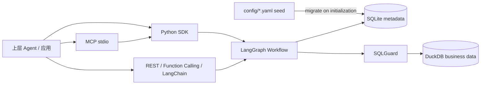

# 当前系统架构

## 范围

本文描述 `meta-in-sqlite` 分支当前实现，覆盖 Python SDK、MCP stdio、LangGraph Workflow、SQLite metadata、DuckDB 业务查询和现有兼容集成。它是当前状态说明，不是历史设计或未来目标架构。

## 上下文和边界

信任边界：上层 Agent 提供问题和可选用户上下文；RDS Agent 控制 metadata 解析、SQL 编译、白名单和执行；业务数据库只接收只读查询。SQLite metadata 不保存业务事实数据。

## 组件

| 组件 | 职责 | 主要接口 | 源码 |
| --- | --- | --- | --- |
| YAML seed | 可审查的 metadata 输入 | `config/*.yaml` | `config/` |
| Migration | 初始化/升级 SQLite metadata | `migrate_yaml_to_sqlite()` | `adapters/yaml_to_sqlite.py` |
| SQLiteCatalog | 表、列、Join Graph 查询 | `get_table()`、`search_schema()`、`find_join_path()` | `adapters/sqlite_catalog.py` |
| SQLiteSemanticLayer | 指标、维度、术语、时间和业务对象解析 | `resolve_*()`、`extract_intent()` | `adapters/sqlite_semantic.py` |
| SemanticQuery | 自然语言后的稳定查询契约 | `SemanticQuery.from_intent()` | `core/semantic.py` |
| Compiler | 语义契约到只读 SQL | `compile()` | `core/compiler.py` |
| Planner | 将意图组织为 QueryPlan | `create_plan()` | `core/planner.py` |
| Generator | 编译器优先，旧模式可 LLM fallback | `generate()` | `core/generator.py` |
| SQLGuard | SELECT、表、函数、Join 风险和 LIMIT 检查 | `validate_sql()` | `core/guard.py` |
| Executor | EXPLAIN、执行、结果限制和进程内审计 | `execute()` | `core/executor.py` |
| Validator | 空结果、异常值、类型和时间检查 | `validate()` | `core/validator.py` |
| Workflow | 固定节点和重试边 | `run()`、`arun()` | `workflow/` |
| SDK | 进程内集成和精简结果 | `RDSAgent` | `integration/sdk.py` |
| MCP | 面向 MCP Agent 的 `query_data` | `create_mcp_server()` | `integration/mcp_server.py` |

## Metadata 模型

SQLite schema 当前包括：`tables`、`columns`、`joins`、`domains`、`entities`、`measures`、`filters`、`metrics`、`dimensions`、`terms`、`examples`、FTS 辅助表和 `metadata_versions`。配置迁移后，运行时组件不再直接读取 YAML。

核心关系：

- `metrics` 引用物理表和 SQL 表达式，可声明时间列、过滤、类型和认证状态。
- `dimensions` 引用展示列、过滤列和业务值映射。
- `joins` 保存方向、基数、`auto_join` 和 `fan_out_risk`，供 Compiler 安全选路。
- `measures` 表达原子度量，`metrics` 表达面向用户的业务指标。
- `terms` 将中文/英文术语和同义词映射到标准语义对象。
- `domains` 限制业务范围并提供时区和币种默认值。

## 查询数据流

1. `classify_request` 从问题提取基础意图。
2. `resolve_semantics` 通过 SQLite SemanticLayer 解析 metric、dimension、filter、term 和时间范围，生成 `SemanticQuery`。
3. `select_schema` 使用解析后的表集合读取 SQLite Catalog，不只依赖关键词命中。
4. `create_query_plan` 创建带语义查询的 `QueryPlan`。
5. `generate_sql` 调用 `SemanticQueryCompiler`；没有 Compiler 的旧装配才使用 LLM fallback。
6. `validate_sql` 通过 SQLGuard 检查；失败时进入有限重试。
7. `explain_sql` 获取执行计划，`execute_sql` 在 DuckDB 上执行只读 SQL。
8. `validate_result` 调用 ResultValidator，保存 warning 和 audit trail。
9. `compose_answer` 生成最终状态，SDK/MCP 再转换为对外协议。

## 部署和运维

- SDK 默认使用内置 DuckDB 样例和临时 SQLite metadata 文件，适合测试。
- 生产部署应指定业务 DuckDB 路径和持久 `metadata_db_path`，并在发布前显式迁移。
- MCP 当前通过 stdio 启动；CLI 没有暴露持久 metadata 参数，因此需要自定义启动代码才能复用固定 SQLite 文件。
- REST、Function Calling 和 LangChain 当前各自初始化 YAML 组件，尚未共享 SDK 的 SQLite 装配。
- `SQLGuard` 默认允许 Catalog 中的所有物理表，最大返回行数为 10000，默认 LIMIT 为 1000。
- Executor 的 query history 只存在进程内，尚未接入持久审计系统。

## 当前约束

- Compiler 至少需要一个 metric；纯明细查询尚未进入确定性主路径。
- 自动 Join 拒绝 `one_to_many`、`many_to_many` 或有 fan-out 风险的边。
- 时间范围要求相关指标使用一致的时间列，尚不支持多时间角色。
- 比较、趋势、诊断计划仍保留旧 Planner 结构，完整同比/环比 SQL 属于后续阶段。
- REST 认证、CORS 和部分 Schema 序列化仍是开发态配置。

## 相关决策

- [ADR-0001：SQLite 作为运行时 metadata source of truth](adr/0001-sqlite-metadata-runtime.md)
