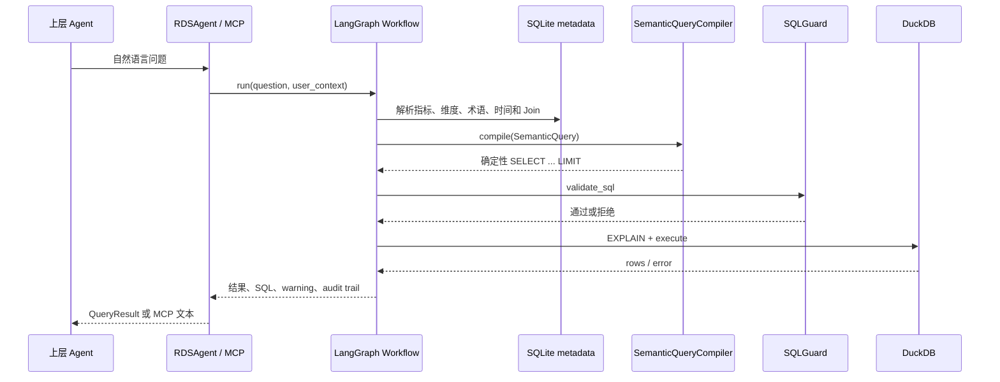

# 项目介绍

## 项目定位

RDS Agent 是一个面向固定数据库和明确业务口径的数据分析 Agent。它把业务人员的自然语言问题映射到 metadata 中的指标、维度、术语和过滤器，构造 `SemanticQuery`，再将查询编译成可审查的只读 SQL。

项目的核心目标不是让模型自由生成任意 SQL，而是让业务语义成为可查询、可测试、可审计的契约。LLM（如果配置）只负责辅助自然语言理解或旧入口的兼容生成；SDK 主路径最终使用确定性 Compiler。

## 当前能力

| 能力 | 当前状态 | 运行时来源 |
| --- | --- | --- |
| 表、列、外键和 Join Graph | 已实现 | SQLite Catalog |
| 指标和维度解析 | 已实现 | SQLite SemanticLayer |
| Domain、Entity、Measure、Filter | 已实现基础模型 | SQLite metadata |
| 中文术语、同义词和值映射 | 已实现 | SQLite FTS/查询 |
| 相对时间解析 | 已实现基础范围 | SemanticLayer reference date |
| 结构化 SemanticQuery | 已实现 | `core.semantic` |
| 确定性 SQL 编译 | 已实现 Phase 2 范围 | `core.compiler` |
| SQL 安全检查 | 已实现基础网关 | `core.guard.SQLGuard` |
| 结果异常和空结果验证 | 已实现基础检查 | `core.validator.ResultValidator` |
| Python SDK | SQLite 主路径 | `integration.sdk.RDSAgent` |
| MCP | SQLite 主路径 | `integration.mcp_server` |
| REST/Function Calling/LangChain | 兼容实现，待统一 | 仍有 YAML + LLM 路径 |

## 数据和配置边界

业务查询数据库当前由 DuckDB adapter 提供；metadata 数据库由 SQLite 提供。两者故意分离：

- DuckDB 保存被分析的业务表和样例数据。
- SQLite 保存语义对象、Schema 描述、Join 安全属性和迁移版本。
- YAML 是可版本控制的输入，适合审查和迁移，不是查询时的运行时 source of truth。

当前示例 domain 是 `retail_sales`，包含 5 张业务表、6 个指标、5 个维度、11 个术语、7 个 examples、4 个 measures、1 个 filter 和 7 个 entities。

## 一次查询做什么



## 快速上手

```python
from integration.sdk import RDSAgent

with RDSAgent() as agent:
    print(agent.get_metrics())
    result = agent.query("各个地区的销售额分别是多少？")
    print(result.data)
```

要使用持久化 metadata：

```python
from adapters.yaml_to_sqlite import migrate_yaml_to_sqlite
from integration.sdk import RDSAgent

migrate_yaml_to_sqlite("config", "var/metadata.db")
with RDSAgent(metadata_db_path="var/metadata.db") as agent:
    result = agent.query("华东地区订单数")
```

## 质量基线

当前代码和文档以分支 `meta-in-sqlite`、基线提交 `d612543` 加工作树变更为依据。验证命令为：

```bash
venv/bin/python -m pytest -q
```

当前结果是 85 个测试通过。内置样例端到端验证结果为：最近一个月华东营收 `3891.00`、华东订单数 `6`、各地区销售额分别为华东 `9580.00`、华南 `1999.00`、华北 `1298.00`。

## 不在当前范围

Policy Engine、行级/列级治理、Trusted Assets、完整时间智能、向量检索、自动 Join 推断、Web 配置编辑器和跨进程审计仍属于后续阶段。生产接入优先使用 SDK 或 MCP；其他入口完成统一装配前应视为兼容或示例能力。
